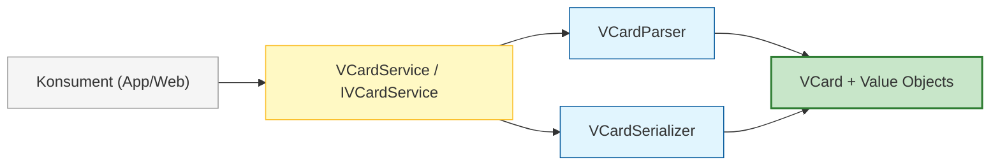
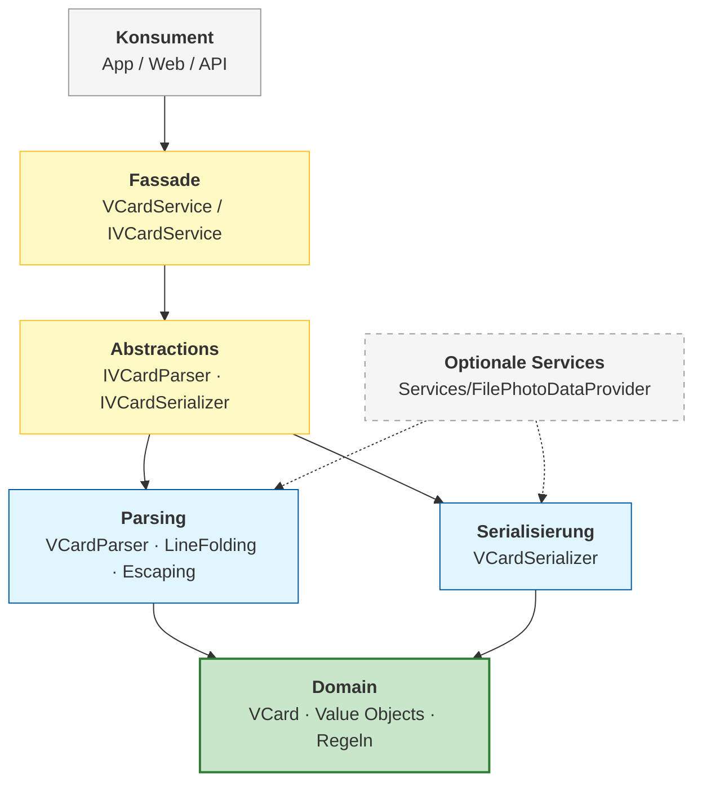
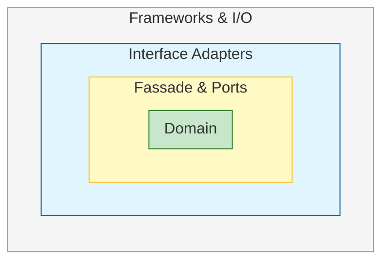
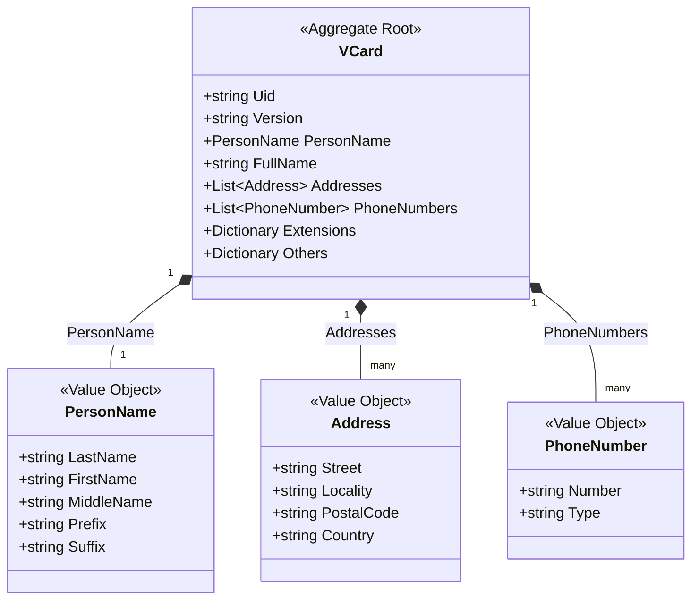
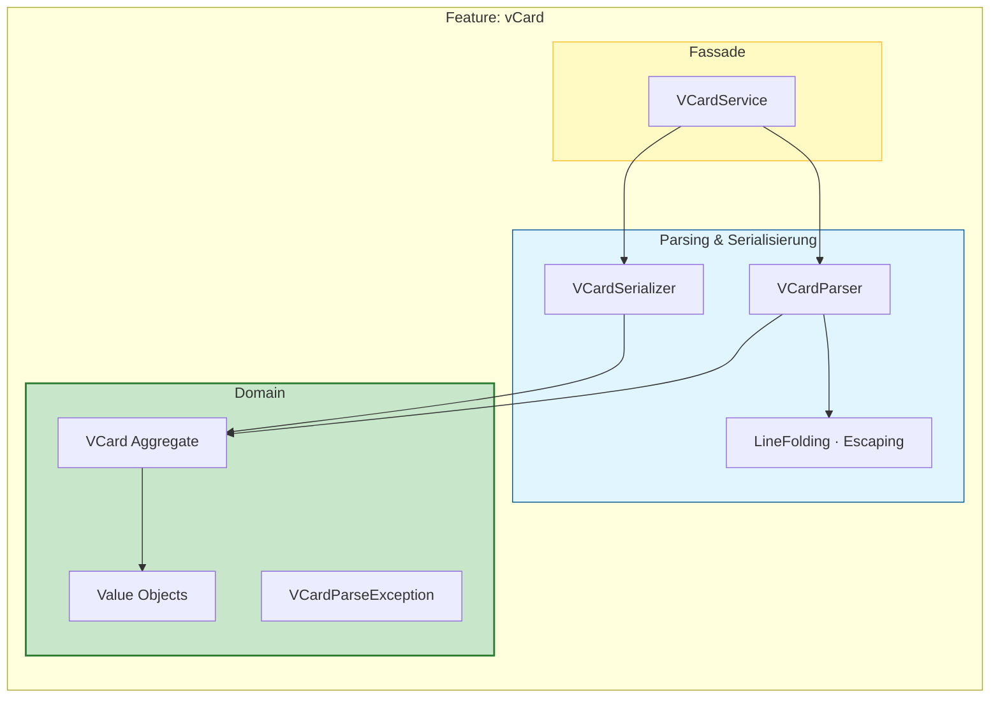

# SOWI.vCard – Architektur & Coding Standards

Best Practices für die vCard-Parser-Bibliothek (RFC 6350)

SOWI Informatik, www.sowi.ch · Franz Schönbächler

---

## Einleitung

**SOWI.vCard** ist eine **Format-Bibliothek** zum Parsen und Serialisieren von vCard-Dateien (Versionen 2.1, 3.0 und 4.0 gemäss RFC 6350). Sie stellt kein UI, keine Persistenz und keine Anwendungslogik bereit, sondern liefert ein Domänenmodell und die Transformation **Text ↔ Objekt**.

Dieses Dokument beschreibt den **Ist-Stand** der Codebasis (übernommen und erweitert) sowie die **verbindlichen Design-Prinzipien** (Clean Architecture light). Abschnitt [Bewusste Abweichungen vom DDD-Zielbild](#bewusste-abweichungen-vom-ddd-zielbild) erklärt, wo der Code bewusst pragmatischer ist als ein striktes DDD-Sollbild.

### Dokumentenaufbau

| Teil | Inhalt |
| ---- | ------ |
| **Ist-Architektur** | Schichten, Ordnerstruktur, Patterns und Code-Beispiele wie im Repository |
| **Design-Prinzipien** | Dependency Rule, SoC, RFC-Orientierung — unabhängig vom konkreten Modellstil |
| **Bewusste Abweichungen** | Mutable Domain, zentrale Handler-Registry — bewusst, nicht als technische Schuld |
| **Optional / später** | Records, einzelne Handler-Dateien, `Domain/Rules/` — nur bei konkretem Bedarf |

---

## Architekturübersicht



### Legende

| Knoten | Schicht | Verantwortung |
| ------ | ------- | ------------- |
| **Konsument (App/Web)** | Extern | Host-Anwendung (Web, Desktop, API), die SOWI.vCard referenziert. Registriert optional Services per DI. Enthält **keine** vCard-Parsing-Logik. |
| **VCardService / IVCardService** | Fassade | Öffentliche, schlanke API der Bibliothek. Orchestriert Parser und Serializer. Einziger empfohlener Einstiegspunkt für Konsumenten. |
| **VCardParser** | Parsing | Transformiert vCard-Text (String/Stream) in Domain-Objekte. Behandelt Line Folding, Escaping, Parameter und versionsspezifische Formate. |
| **VCardSerializer** | Serialisierung | Transformiert Domain-Objekte zurück in RFC-konformen vCard-Text. |
| **VCard + Value Objects** | Domain | Fachlicher Kern: Aggregate Root `VCard`, Value Objects (`Address`, `Email`, `PersonName`, …), Invarianten und fachliche Exceptions. **Kein** Datei-I/O, **kein** String-Parsing. |

**Abhängigkeitsrichtung:** Alle Pfeile zeigen zur Domain. Parser und Serializer kennen die Domain; die Domain kennt weder Parser noch Serializer.

---

## Schichtenmodell (Clean Architecture light)



| Schicht / Ordner | Verantwortung / Inhalt |
| ---------------- | ---------------------- |
| **Domain** | Aggregate Root `VCard`, mutable Value Objects, fachliche Exceptions (`VCardParseException`). Keine Abhängigkeit zu Dateisystem, HTTP oder Parsing-Details. |
| **Abstractions** | Ports/Interfaces: `IVCardParser`, `IVCardSerializer`, optional `IVCardService`, `IPhotoDataProvider`. |
| **Parsing** | RFC-Implementierung: Zeilen zerlegen, Line Folding, Escaping, Property-Handler, versionsspezifische Strategien (2.1 / 3.0 / 4.0). |
| **Serialisierung** | Erzeugung RFC-konformen vCard-Texts aus dem Domänenmodell, versionsspezifische Datums- und Property-Formate. |
| **Fassade** | `VCardService`: `Parse`/`Serialize`, async Datei-/Stream-I/O auf `IVCardService`. |
| **Optionale Services** | Datei-/Ressourcenzugriff (`Services/FilePhotoDataProvider`), nur über `IPhotoDataProvider` — nicht in Domain-Klassen. |

### Bewusst weggelassen (YAGNI)

Für SOWI.vCard sind folgende Schichten **nicht vorgesehen**, da sie dem Bibliothekscharakter widersprechen:

| Schicht | Begründung |
| ------- | ---------- |
| **Presentation** | UI liegt beim Konsumenten, nicht in der Library. |
| **Application (Commands/Queries)** | `Parse` und `Serialize` sind die einzigen Use Cases – eine eigene Application-Schicht wäre Overhead. |
| **Composition Root** | DI-Registrierung erfolgt in der Host-Anwendung (`Program.cs` des Konsumenten). |
| **Repository / Persistenz** | Keine Datenbank; vCards werden als Text übergeben oder empfangen. |
| **Feature Slices (vertikal)** | Ein fachliches Feature: vCard-Parsing. Keine parallelen Domänen (Orders, Customers, …). |

---

## 1. Clean Architecture für Format-Bibliotheken

Clean Architecture trennt Software in klar definierte Schichten, sodass Fachlogik unabhängig von Frameworks, UI und technischen Details bleibt. Für **SOWI.vCard** bedeutet das:

- Das **Domänenmodell** bildet die vCard-Spezifikation ab (Properties, Strukturen, Regeln).
- **Parsing und Serialisierung** sind austauschbare Adapter – nicht Bestandteil der Domain-Entities.
- Die Bibliothek bleibt **testbar**, **RFC-erweiterbar** und **ohne Host-Abhängigkeiten** nutzbar.



| Ring | SOWI.vCard-Bezug |
| ---- | ---------------- |
| **Entities (innen)** | `VCard`, `Address`, `PersonName`, … |
| **Use Cases** | `IVCardService` – Parse / Serialize |
| **Interface Adapters** | `VCardParser`, `VCardSerializer` |
| **Frameworks & I/O** | Streams, Dateien (nur in optionalen Services) |

Softwarearchitektur – Grundlagen  
https://learn.microsoft.com/de-de/azure/architecture/guide/

---

## 2. Dependency Rule

Die Dependency Rule besagt: **Alle Abhängigkeiten zeigen nur nach innen zur Domain**, nie von der Domain nach aussen. So bleibt das vCard-Modell unabhängig von Parsing-Implementierung, .NET-Version oder Konsument.

```csharp
/// <summary>
/// Port zum Parsen von vCard-Text in Domain-Objekte.
/// </summary>
public interface IVCardParser
{
    VCard Parse(string vCardText);
    IReadOnlyList<VCard> ParseDocument(string vCardText);
}

/// <summary>
/// Port zum Serialisieren von Domain-Objekten in vCard-Text.
/// </summary>
public interface IVCardSerializer
{
    string Serialize(VCard vCard);
    string SerializeDocument(IReadOnlyList<VCard> vCards);
}
```

Architekturprinzipien (inkl. Dependency Inversion)  
https://learn.microsoft.com/de-de/azure/architecture/guide/design-principles/

---

## 3. Schichtenmodell & Aufgaben (Ist-Stand)

```
Domain/
 ├─ VCard.cs                      ← Aggregate Root (mutable POCO)
 ├─ ValueObjects/                 ← Address, Email, PersonName, GeoLocation, …
 └─ Exceptions/                   ← VCardParseException

Abstractions/
 ├─ IVCardParser.cs
 ├─ IVCardSerializer.cs
 ├─ IVCardService.cs
 ├─ IVCardLineReader.cs
 └─ IPhotoDataProvider.cs          ← optional

Parsing/
 ├─ VCardParser.cs
 ├─ VCardBlockParser.cs
 ├─ VCardLineReader.cs             ← Line Folding, Escaping
 ├─ VCardPropertyLineParser.cs
 ├─ VCardPropertyParsers.cs
 ├─ PropertyHandlers/
 │    ├─ IVCardPropertyHandler.cs
 │    ├─ VCardPropertyHandlerRegistry.cs   ← zentrale Handler-Registrierung
 │    └─ VCardParseContext.cs
 └─ VersionStrategies/             ← 2.1, 3.0, 4.0

Serialization/
 ├─ VCardSerializer.cs
 └─ VCardPropertyWriters.cs       ← Property-Ausgabe (eine Datei)

Services/
 ├─ VCardService.cs                ← Fassade
 └─ FilePhotoDataProvider.cs       ← optionales Datei-/Ressourcen-I/O
```

| Schicht | Aufgabe |
| ------- | ------- |
| **Domain** | vCard-Fachmodell gemäss RFC 6350 und `src/README.md`. Mutable Datencontainer für Parser und Konsumenten. Kein String-Parsing, kein Datei-I/O. |
| **Abstractions** | Interfaces (Ports) für Parser, Serializer, Line Reader und optionale I/O-Services. |
| **Parsing / Serialisierung** | RFC-Logik: Zeilenformat, Parameter, Escaping, versionsspezifische Formate. Implementiert die Ports. |
| **Fassade** | `VCardService`: öffentliche API inkl. async Datei-/Stream-I/O. Enthält *keine* RFC-Details. |

*Beispiel – Aggregate Root (Domain, Ist-Implementierung)*

```csharp
/// <summary>
/// Repräsentiert eine vCard gemäss RFC 6350.
/// </summary>
public class VCard
{
    public string Uid { get; set; } = Guid.NewGuid().ToString();
    public string Version { get; set; } = string.Empty;
    public string FullName { get; set; } = string.Empty;
    public PersonName PersonName { get; set; } = new();
    public List<Address> Addresses { get; set; } = new();
    public List<PhoneNumber> PhoneNumbers { get; set; } = new();
    public Dictionary<string, string> Extensions { get; set; } = new();
    public Dictionary<string, string> Others { get; set; } = new();
    // … weitere RFC-Properties
}
```

*Beispiel – Parser (Parsing-Schicht)*

```csharp
public class VCardParser : IVCardParser
{
    private readonly IVCardLineReader _lineReader;

    public VCardParser(IVCardLineReader lineReader)
    {
        _lineReader = lineReader;
    }

    public VCard Parse(string vCardText)
    {
        var normalized = _lineReader.Normalize(vCardText.Trim());
        return VCardBlockParser.Parse(normalized);
    }
}
```

*Beispiel – Fassade (Services)*

```csharp
public class VCardService : IVCardService
{
    private readonly IVCardParser _parser;
    private readonly IVCardSerializer _serializer;
    private readonly IPhotoDataProvider? _photoDataProvider;

    public static VCardService CreateDefault(bool includePhotoProvider = false) { /* … */ }

    public VCard Parse(string vCardText) => _parser.Parse(vCardText);

    public string Serialize(VCard vCard) => _serializer.Serialize(vCard);

    public Task<VCard> ParseFileAsync(string filePath, CancellationToken ct = default) { /* … */ }
}
```

*Beispiel – Konsument (externe App)*

```csharp
// Registrierung in der Host-Anwendung (Composition Root des Konsumenten)
services.AddSingleton<IVCardLineReader, VCardLineReader>();
services.AddSingleton<IVCardParser, VCardParser>();
services.AddSingleton<IVCardSerializer, VCardSerializer>();
services.AddSingleton<IVCardService, VCardService>();

// Verwendung
public class ContactImportService
{
    private readonly IVCardService _vCardService;

    public ContactImportService(IVCardService vCardService)
    {
        _vCardService = vCardService;
    }

    public VCard ImportFromFile(string content)
    {
        return _vCardService.Parse(content);
    }
}
```

Architektur-Stile & Schichtenmodelle  
https://learn.microsoft.com/de-de/dotnet/architecture/modern-web-apps-azure/

---

## 4. Projektstruktur (Ist-Stand)

Für den aktuellen Umfang genügt **ein Projekt** mit logischer Ordnerstruktur. Mehrere Projekte (`Domain`, `Infrastructure`, …) sind erst sinnvoll, wenn parallele Parser-Backends (z. B. xCard/XML) oder strikte NuGet-Grenzen benötigt werden.

```text
src/
 ├── SOWI.vCard.csproj
 ├── Domain/
 │    ├── VCard.cs
 │    ├── ValueObjects/
 │    └── Exceptions/
 ├── Abstractions/
 ├── Parsing/
 │    ├── PropertyHandlers/
 │    └── VersionStrategies/
 ├── Serialization/
 ├── Services/
 │    ├── VCardService.cs
 │    └── FilePhotoDataProvider.cs
 └── README.md                  ← RFC-Property-Referenz

tests/
 └── SOWI.vCard.Tests/
      ├── Domain/
      │    └── GeoLocationTests.cs
      ├── Parsing/
      │    ├── VCardLineReaderTests.cs      ← Line Folding & Escaping
      │    ├── Phase4PropertyTests.cs
      │    ├── Phase5PropertyTests.cs
      │    └── VersionStrategyTests.cs
      ├── Serialization/
      │    └── VCardSerializerTests.cs
      ├── Services/
      │    └── PhotoDataProviderTests.cs
      ├── Integration/
      │    ├── ReadmeExampleTests.cs        ← README-Beispiele 2.1 / 3.0 / 4.0
      │    ├── RoundTripTests.cs
      │    ├── OutlookAppleFixtureTests.cs
      │    └── Phase6StreamAndFinalizeTests.cs
      └── Fixtures/
```

.NET-Projektstruktur & Best Practices  
https://learn.microsoft.com/de-de/dotnet/architecture/modern-web-apps-azure/

---

## 5. Architektur-Guidelines

| Prinzip | Bedeutung für SOWI.vCard |
| ------- | ------------------------ |
| **Independence of Frameworks** | Domain kennt kein ASP.NET, kein EF Core, kein Dateisystem. |
| **Separation of Concerns** | Parsing ≠ Domain-Modell ≠ Serialisierung. |
| **Interface-Driven Design** | `IVCardParser`, `IVCardSerializer` als Ports. |
| **Testability** | Round-Trip-Tests: Parse → Serialize → Parse mit README-Beispielen. |
| **RFC as Domain Language** | Property-Namen und Strukturen folgen RFC 6350 und `src/README.md`. |
| **Layer Stability** | Änderungen am Parser-Format beeinflussen Domain-Entities nicht. |
| **YAGNI** | Keine Application-Schicht, kein CQRS, solange nur Parse/Serialize existieren. |
| **KISS** | Ein Projekt, klare Ordner – keine Premature Multi-Project-Splitting. |

Design-Prinzipien (SOLID, DRY, KISS, SoC)  
https://learn.microsoft.com/de-de/azure/architecture/guide/design-principles/

---

## Bewusste Abweichungen vom DDD-Zielbild

Der Quellcode wurde aus einem bestehenden Projekt übernommen; die Architektur-Dokumentation orientiert sich am **Ist-Stand**, nicht an einem strikten DDD-Sollbild. Folgende Abweichungen sind **bewusst** und für eine Format-Bibliothek üblich:

| Thema | DDD-Zielbild (nicht umgesetzt) | Ist-Implementierung | Begründung |
| ----- | ------------------------------ | ------------------- | ---------- |
| **Domain-Modell** | Immutable Aggregate, `private set`, `AddAddress()` | Mutable POCOs mit `{ get; set; }` | Einfache Erstellung per Object Initializer; Parser setzt Properties direkt |
| **PersonName** | `sealed record` | Mutable Klasse | Kein Breaking Change; ausreichend für RFC-Struktur |
| **GeoLocation** | Konstruktor wirft bei ungültigen Werten | `IsValid()`-Methode, leere GEO erlaubt | Parser toleriert fehlende/optionale Koordinaten |
| **Property-Handler** | Eine Klasse pro Property (`FullNamePropertyHandler`, …) | `VCardPropertyHandlerRegistry` zentral | Weniger Dateien, übersichtlich bei festem Property-Set (KISS) |
| **Handler-Factory** | `VCardPropertyHandlerFactory` | `VCardPropertyHandlerRegistry.CreateDefault()` | Gleiche Aufgabe, anderer Name |
| **I/O-Services** | Ordner `Optional/` | `Services/FilePhotoDataProvider.cs` | Reine Ordnerfrage; Verantwortung identisch |
| **Domain/Rules/** | Eigener Ordner für Invarianten | Validierung in Parser und Value Objects | YAGNI — kein separater Rules-Layer nötig |
| **PropertyWriters** | Unterordner `PropertyWriters/` | `VCardPropertyWriters.cs` (eine Datei) | Ausreichend für aktuellen Umfang |

### Optional / später (nur bei konkretem Bedarf)

- `PersonName` und weitere Value Objects als `record` (Breaking Change → eher Major-Version)
- Handler in Einzeldateien aufteilen, wenn einzelne Handler > 200 Zeilen wachsen
- `Domain/Rules/` für komplexere fachliche Invarianten ausserhalb des RFC-Kerns

---

## 6. Domain-Driven Design (DDD) für vCard

DDD strukturiert die Domäne so, dass sie die vCard-Spezifikation abbildet. In SOWI.vCard wird DDD **leichtgewichtig** angewendet: `VCard` ist das Aggregate Root-Konzept, Value Objects modellieren RFC-Strukturen — ohne strikte Unveränderlichkeit oder Repository-Schicht.

### 6.1 Kernkonzepte

| Konzept | SOWI.vCard-Bezug |
| ------- | ---------------- |
| **Ubiquitous Language** | RFC-Property-Namen: `FN`, `N`, `ADR`, `TEL`, `VERSION`, … |
| **Entities** | `VCard` mit Identität über `UID` |
| **Value Objects** | `Address`, `Email`, `PhoneNumber`, `PersonName`, `GeoLocation` |
| **Aggregates** | `VCard` als Konsistenzgrenze für alle Properties |
| **Aggregate Root** | `VCard` – zentrale Datenstruktur für alle Properties |
| **Domain Events** | Optional bei Bedarf (z. B. `VCardParsed`); standardmässig nicht erforderlich |
| **Repositories** | Nicht vorgesehen – kein Persistenz-Layer |

### 6.2 Aggregate: VCard



### 6.3 Value Objects

Value Objects modellieren RFC-Strukturen. Sie enthalten **keine** Parse- oder Serialize-Methoden. In der Ist-Implementierung sind sie **mutable Klassen** (pragmatisch für Parser und Konsumenten):

```csharp
public class PersonName
{
    public string Prefix { get; set; } = string.Empty;
    public string FirstName { get; set; } = string.Empty;
    public string MiddleName { get; set; } = string.Empty;
    public string LastName { get; set; } = string.Empty;
    public string Suffix { get; set; } = string.Empty;
}

public class GeoLocation
{
    public double Latitude { get; set; }
    public double Longitude { get; set; }
    public string Separator { get; set; } = ";";
    public bool IsUriFormat { get; set; }

    public bool IsValid()
    {
        return Latitude is >= -90 and <= 90
            && Longitude is >= -180 and <= 180;
    }
}
```

### 6.4 Zusammenspiel mit Clean Architecture

| Clean Architecture | DDD-Bezug in SOWI.vCard |
| ------------------ | ----------------------- |
| Domain | `VCard` + Value Objects |
| Fassade / Ports | `IVCardService` |
| Interface Adapters | Parser, Serializer |
| Bounded Context | vCard-Format (RFC 6350) |

DDD – Domain Model  
https://learn.microsoft.com/de-de/azure/architecture/microservices/model/domain-model

---

## 7. Design-Patterns

```
Facade:      VCardService – einfache API über Parser/Serializer
Parser:      vCard-Text → Domain-Objekte (VCardParser, VCardBlockParser)
Serializer:  Domain-Objekte → vCard-Text
Strategy:    Versionsspezifische Formate (2.1 / 3.0 / 4.0)
Registry:    VCardPropertyHandlerRegistry – zentrale Handler-Registrierung
```

Design-Patterns liefern erprobte Lösungsansätze für wiederkehrende Struktur- und Verhaltensprobleme. Für SOWI.vCard sind **Parser**, **Facade** und **Strategy** die wichtigsten Muster.

### 7.1 Facade Pattern

Die Fassade versteckt Parsing-, Serialisierungs- und RFC-Details hinter einer einfachen API.

```csharp
public interface IVCardService
{
    VCard Parse(string vCardText);
    IReadOnlyList<VCard> ParseDocument(string vCardText);
    string Serialize(VCard vCard);
    Task<VCard> ParseFileAsync(string filePath, CancellationToken ct = default);
}
```

Facade Pattern  
https://learn.microsoft.com/de-de/azure/architecture/patterns/facade

### 7.2 Parser Pattern

Parser kapseln die Transformation externer Datenformate in Domain-Objekte. Das Domänenmodell bleibt frei von Format- und Protokoll-Details.

```csharp
public interface IVCardParser
{
    VCard Parse(string vCardText);
    IReadOnlyList<VCard> ParseDocument(string vCardText);
}

public class VCardParser : IVCardParser
{
    private readonly IVCardLineReader _lineReader;

    public VCardParser(IVCardLineReader lineReader)
    {
        _lineReader = lineReader;
    }

    public VCard Parse(string vCardText)
    {
        var normalized = _lineReader.Normalize(vCardText.Trim());
        return VCardBlockParser.Parse(normalized);
    }
}
```

Adapter Pattern  
https://learn.microsoft.com/de-de/azure/architecture/patterns/adapter

### 7.3 Strategy Pattern

Versionsspezifische Unterschiede (Datumsformate, GEO-Syntax, PHOTO-Encoding) werden über Strategien gekapselt.

```csharp
public interface IVCardVersionStrategy
{
    bool Supports(string version);
    DateTime? ParseDate(string value);
    string FormatDate(DateTime value);
    string FormatGeo(GeoLocation geo);
}

public class VCard40Strategy : IVCardVersionStrategy
{
    public bool Supports(string version) => version == "4.0";

    public DateTime? ParseDate(string value) { /* yyyyMMdd, yyyy-MM-dd, … */ return null; }

    public string FormatDate(DateTime value) => value.ToString("yyyyMMdd");

    public string FormatGeo(GeoLocation geo)
        => $"geo:{geo.Latitude}\\,{geo.Longitude}";
}
```

Strategy Pattern  
https://learn.microsoft.com/de-de/azure/architecture/patterns/strategy

### 7.4 Registry Pattern (Property-Handler)

Property-Handler werden in `VCardPropertyHandlerRegistry` zentral registriert, statt in der Domain verstreut zu werden:

```csharp
public interface IVCardPropertyHandler
{
    bool CanHandle(string propertyName);
    void Apply(VCardParseContext context);
}

internal static class VCardPropertyHandlerRegistry
{
    internal static IReadOnlyList<IVCardPropertyHandler> CreateDefault()
        => new IVCardPropertyHandler[]
        {
            new ActionPropertyHandler("FN", ctx => ctx.VCard.FullName = ctx.Value),
            new ActionPropertyHandler("N", ctx => ctx.VCard.PersonName = VCardPropertyParsers.ParsePersonName(ctx.Value)),
            new AddressPropertyHandler(),
            // …
        };
}
```

Registry Pattern (zentrale Registrierung, verwandt mit Factory Method)  
https://learn.microsoft.com/de-de/azure/architecture/patterns/factory-method

---

## 8. Implementierungsregeln

- **Horizontal:** technische Trennung (Domain, Parsing, Serialisierung, Fassade)
- **Vertikal:** nicht erforderlich – ein Feature (vCard)
- **DDD** liefert das Modell im Zentrum
- **Parser/Serializer** sind getrennt – **kein** Parsing in Domain-Klassen



### 8.1 RFC-Pflichten beim Parsing

| Regel | Beschreibung |
| ----- | ------------ |
| **Line Folding** | Fortgesetzte Zeilen (führendes Leerzeichen/Tab) müssen zusammengeführt werden. |
| **Escaping** | `\n`, `\,`, `\;`, `\\` gemäss RFC 6350 behandeln. |
| **VERSION** | Pflichtfeld; in 3.0/4.0 direkt nach `BEGIN:VCARD`. |
| **Mehrfach-vCards** | Ein Dokument kann mehrere `BEGIN:VCARD`…`END:VCARD`-Blöcke enthalten. |
| **Unbekannte Properties** | Über Erweiterungsmechanismus (`X-…`, RFC-Erweiterungen) ablegbar, z. B. `Others`-Dictionary am Aggregate. |

### 8.2 Async bei I/O

Reines String-Parsing ist synchron. **Asynchron** nur bei echtem I/O (Datei lesen, Stream):

```csharp
public interface IVCardParser
{
    VCard Parse(string vCardText);

    Task<VCard> ParseAsync(Stream stream, CancellationToken ct = default);
}
```

Asynchrone Programmierung in C#  
https://learn.microsoft.com/de-de/dotnet/csharp/asynchronous-programming/

### 8.3 Domain-spezifische Exceptions

Fehler werden fachlich signalisiert, nicht mit generischen technischen Exceptions.

```csharp
public class VCardParseException : Exception
{
    public string? PropertyName { get; }
    public int? LineNumber { get; }

    public VCardParseException(string message, string? propertyName = null, int? lineNumber = null)
        : base(message)
    {
        PropertyName = propertyName;
        LineNumber = lineNumber;
    }

    public VCardParseException(string message, Exception inner)
        : base(message, inner) { }
}
```

Exception-Design-Guidelines  
https://learn.microsoft.com/de-de/dotnet/standard/design-guidelines/exceptions

### 8.4 Verbotene Muster

| Anti-Pattern | Korrekte Alternative |
| ------------ | -------------------- |
| `Parse()` in Domain-Klassen (`Address`, `Email`, …) | Property-Handler in Parsing-Schicht |
| `File.ReadAllBytes` in `Photo` (Domain) | `IPhotoDataProvider` in `Services/FilePhotoDataProvider` |
| God Class mit Parse + Serialize + ToString + ToDictionary | Getrennte Klassen pro Verantwortung |
| Generische `ArgumentException` für RFC-Fehler | `VCardParseException` mit Property/Kontext |

---

## 9. Naming Conventions

Konsistente Benennung macht Code vorhersagbar. vCard-RFC-Namen gelten in Domain und Serialisierung.

| Element | Konvention | SOWI.vCard-Beispiel |
| ------- | ---------- | ------------------- |
| Klassen | PascalCase | `VCardParser`, `Address` |
| Interfaces | I-Prefix + PascalCase | `IVCardParser`, `IVCardService` |
| Aggregate Root | PascalCase | `VCard` |
| Value Objects | PascalCase | `PersonName`, `GeoLocation` |
| Methoden | PascalCase | `Parse()`, `Serialize()` |
| Async-Methoden | Async-Suffix | `ParseAsync()` |
| Private Felder | _camelCase | `_lineReader` |
| Parameter/Variablen | camelCase | `vCardText`, `lineNumber` |
| RFC-Properties (Serialisierung) | RFC-Grossbuchstaben | `FN`, `ADR`, `TEL` in Output |
| Exceptions | …Exception | `VCardParseException` |
| Enums | Singular | `VCardVersion` |

.NET-Namenskonventionen  
https://learn.microsoft.com/de-de/dotnet/standard/design-guidelines/naming-guidelines

---

## 10. Clean Code

Clean Code stellt sicher, dass die Architektur im Alltag nicht «kaputtrefaktoriert» wird.

### 10.1 Prinzipien

| Prinzip | Bedeutung |
| ------- | --------- |
| **KISS** | Ein Projekt, klare Ordner. Keine unnötigen Abstraktionsschichten. |
| **DRY** | Line-Parsing, Parameter-Extraktion und Escaping **einmal** in `VCardLineReader` – nicht in jeder Value-Object-Klasse wiederholen. |
| **YAGNI** | Kein CQRS, keine Repository-Schicht, kein Multi-Project-Split ohne konkreten Bedarf. |
| **SoC** | Domain = Modell; Parsing = RFC-Text → Modell; Serialisierung = Modell → RFC-Text. |

Design-Prinzipien (KISS, DRY, SoC)  
https://learn.microsoft.com/de-de/azure/architecture/guide/design-principles/

### 10.2 Methoden- & Klassenstruktur

| Element | Empfehlung |
| ------- | ---------- |
| Methoden | 5–15 Zeilen |
| Parameter | max. 3–4 |
| Verschachtelung | max. 2–3 Ebenen |
| Klassengrösse | `VCardPropertyHandlerRegistry` und Property-Handler statt einer 900-Zeilen-Klasse |

### 10.3 Fehlerbehandlung

```csharp
if (string.IsNullOrWhiteSpace(vCardText))
    throw new ArgumentException("vCard-Text darf nicht leer sein.", nameof(vCardText));

if (!line.StartsWith("BEGIN:VCARD", StringComparison.OrdinalIgnoreCase))
    throw new VCardParseException("Ungültiger vCard-Beginn.", lineNumber: 1);
```

### 10.4 Quellcode-Konventionen (SOWI)

| Regel | Vorgabe |
| ----- | ------- |
| Datei-Header | `SOWI Informatik, www.sowi.ch` und `Franz Schönbächler` |
| Kommentare / XML-Docs | Deutsch |
| XML-Zeilenumbrüche | `<br />` bei langen Summary-Texten (> 100 Zeichen) |
| Formatierung | `.editorconfig` im Repository |
| Nullable | `Nullable enable` im Projekt |

---

## 11. Testing

Tests spiegeln die Schichtenstruktur wider und prüfen **Verhalten**, nicht Implementierungsdetails.

```text
tests/SOWI.vCard.Tests/
 ├── Domain/
 │    └── GeoLocationTests.cs
 ├── Parsing/
 │    ├── VCardLineReaderTests.cs       ← Line Folding & Escaping
 │    ├── Phase4PropertyTests.cs
 │    ├── Phase5PropertyTests.cs
 │    └── VersionStrategyTests.cs
 ├── Serialization/
 │    └── VCardSerializerTests.cs
 ├── Services/
 │    └── PhotoDataProviderTests.cs
 ├── Integration/
 │    ├── ReadmeExampleTests.cs         ← README-Beispiele 2.1 / 3.0 / 4.0
 │    ├── RoundTripTests.cs
 │    ├── OutlookAppleFixtureTests.cs
 │    └── Phase6StreamAndFinalizeTests.cs
 └── Fixtures/
```

### 11.1 Pflicht-Testfälle

| Test | Ziel |
| ---- | ---- |
| **Round-Trip** | Parse → Serialize → Parse; Daten bleiben erhalten |
| **README-Beispiele** | Alle drei Beispiele aus `src/README.md` müssen parsebar sein |
| **Line Folding & Escaping** | `VCardLineReaderTests` — Fortsetzungszeilen, `\n`, `\,`, `\;` |
| **Version 4.0 GEO** | `geo:lat,lon`-Format |
| **Unbekannte X-Properties** | Werden erhalten (Erweiterbarkeit) |
| **Fehlerfälle** | Leerer Input, fehlendes `VERSION`, ungültige Zeile → `VCardParseException` |

Unit Testing in .NET  
https://learn.microsoft.com/de-de/dotnet/core/testing/

---

## 12. Sicherheit & Binärdaten

SOWI.vCard verarbeitet personenbezogene Kontaktdaten und optional Binärdaten (`PHOTO`).

| Aspekt | Vorgabe |
| ------ | ------- |
| **Binärdaten** | Base64-Dekodierung nur im Parser; Grösse optional begrenzen |
| **Datei-I/O** | Nur über `IPhotoDataProvider`; Pfade validieren |
| **Externe URLs** | `PHOTO`-URLs werden nicht automatisch geladen (kein impliziter HTTP-Zugriff) |
| **Sensible Felder** | `KEY`, `CLASS` als Domain-Properties; keine Speicherung in Logs |

ASP.NET Core Data Protection  
https://learn.microsoft.com/de-de/aspnet/core/security/data-protection/introduction

---

## 13. Tooling & CI/CD

| Tool | Zweck | Status |
| ---- | ----- | ------ |
| **`.editorconfig`** | Konsistenter Stil, SOWI-Datei-Header-Vorlage | Im Repository |
| **`dotnet test`** | Round-Trip- und RFC-Tests | Lokal und in CI |
| **Roslynator / SonarLint** | Zusätzliche Analyzer in der IDE | Optional, nicht als NuGet-Paket |
| **GitHub Actions** | Build, Test, Pack | Geplant (siehe Beispiel) |

Beispiel für GitHub Actions (`.github/workflows/ci.yml`):

```yaml
name: CI

on:
  push:
    branches: [main, develop]
  pull_request:
    branches: [main, develop]

jobs:
  build:
    runs-on: ubuntu-latest
    steps:
      - uses: actions/checkout@v4
      - uses: actions/setup-dotnet@v4
        with:
          dotnet-version: '8.0.x'
      - run: dotnet build SOWI.vCard.slnx -c Release
      - run: dotnet test SOWI.vCard.slnx -c Release --no-build
```

Code-Analyse & .editorconfig  
https://learn.microsoft.com/de-de/dotnet/fundamentals/code-analysis/overview

GitHub Actions – .NET  
https://docs.github.com/en/actions/automating-builds-and-tests/building-and-testing-net

---

## 14. Gesamtfazit

```
Clean Architecture light = schlanke Schichten für eine Bibliothek
Domain (RFC-Modell)      = mutable Datencontainer, fachlicher Kern
Parser / Serializer      = Interface Adapters
VCardService (Facade)    = öffentliche API
Tests (Round-Trip)       = RFC-Konformität absichern
Clean Code (KISS/YAGNI)  = keine Over-Engineering-Schichten
```

SOWI.vCard folgt den **Prinzipien** der Clean Architecture – Dependency Rule, Separation of Concerns, testbare Schichten – in einer **bibliotheksgerechten, reduzierten Form**. Der Ist-Code nutzt bewusst mutable Domain-Modelle und eine zentrale Handler-Registry statt striktem DDD. Presentation, Persistenz und Application-Commands entfallen bewusst. Parser Pattern, Fassade und klares Domänenmodell stehen im Mittelpunkt.

Microsoft .NET Application Architecture Guides  
https://learn.microsoft.com/de-de/dotnet/architecture/
