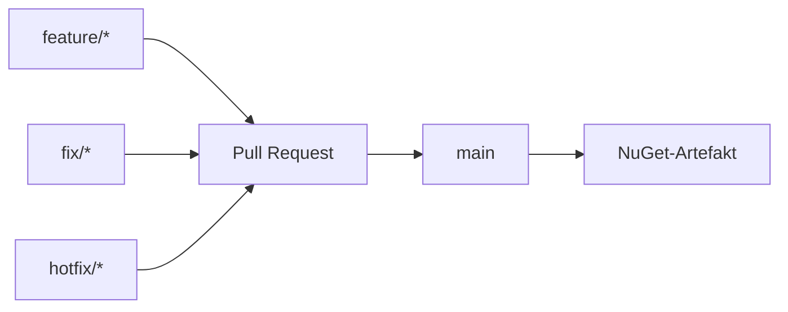
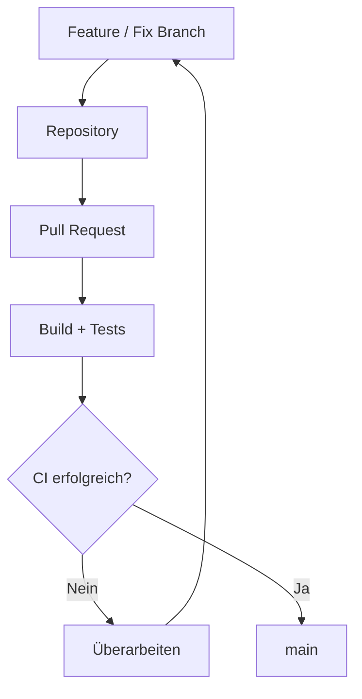
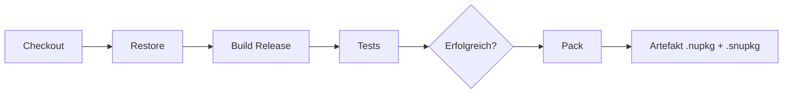
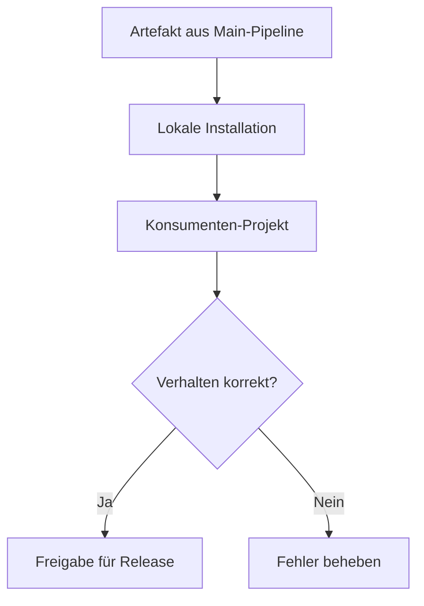
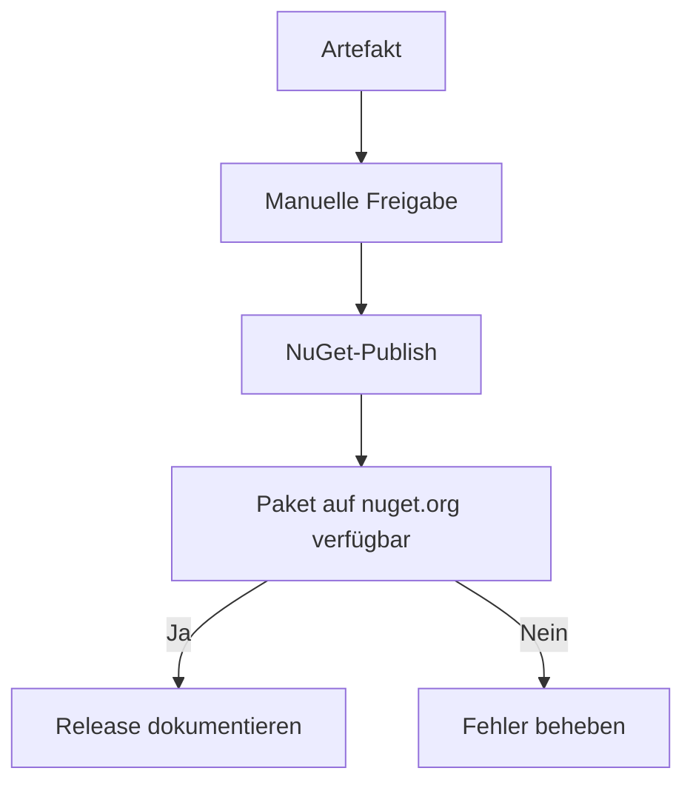
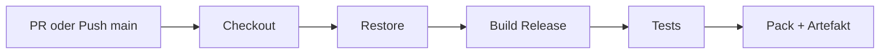
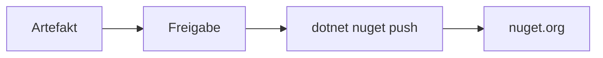
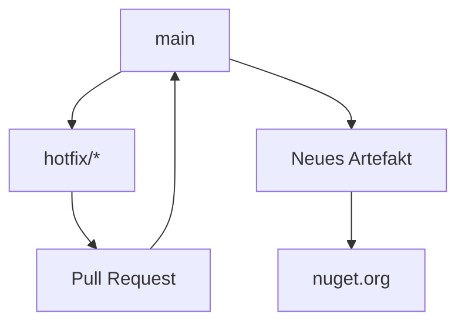

# SOWI.vCard – CI/CD

Standardisierte Bereitstellung der **SOWI.vCard**-NuGet-Bibliothek (.NET 8, RFC 6350)

SOWI Informatik, www.sowi.ch · Franz Schönbächler

---

## Ziele

- Reproduzierbarer Build, Test und Pack der Bibliothek als versioniertes NuGet-Paket
- Automatisierte Qualitätssicherung (Build, Unit- und Integrationstests) vor jedem Merge nach `main`
- Vollständige Nachvollziehbarkeit von Commits, Build-Nummern und veröffentlichten Paketversionen
- Minimierung manueller Fehler beim Erzeugen und Veröffentlichen von Releases
- Kontrollierte Freigabe vor der Veröffentlichung auf [nuget.org](https://www.nuget.org/packages/SOWI.vCard)
- Einheitliches Vorgehen gemäss SOWI CI/CD-Standard, angepasst an den Charakter einer Open-Source-Format-Bibliothek

**Nicht-Ziele**

- Vollautomatische Veröffentlichung auf nuget.org ohne manuelle Freigabe
- Bereitstellung als Web-Anwendung oder FTP-Deployment (kein Host-System)
- Datenbankmigrationen oder Schema-Compare (keine Persistenzschicht)
- Health-Check-Endpunkte oder Deployment-Verifikation auf Servern
- Ersatz von fachlichen Abnahmetests durch Konsumenten-Projekte
- Parallele Veröffentlichungsprozesse ausserhalb der definierten CI/CD-Pipeline

---

## Grundlagen

### Komponenten

| Komponente | Beschreibung |
| ---------- | ------------ |
| **GitHub** | Quellcode, Pull Requests, GitHub Actions, Branch Protection, Secrets |
| **CI/CD Pipeline** | Build, Tests, Pack und optional NuGet-Publish |
| **NuGet.org** | Öffentliches Paket-Repository für Release-Versionen |
| **GitHub Packages** | Optionales internes oder Pre-Release-Feed |
| **Artefakt-Speicher** | GitHub Actions Artifacts (`.nupkg`, `.snupkg`) |
| **Secrets Management** | GitHub Repository Variables; NuGet Trusted Publishing (OIDC, kein langlebiger API-Key) |
| **Release Management** | Manuelle Freigabe vor Produktiv-Veröffentlichung |
| **Unit Tests** | Prüfung einzelner Komponenten (Parser, Serializer, Domain) |
| **Integrationstests** | Round-Trip, README-Beispiele, Outlook-/Apple-Fixtures |
| **Monitoring** | GitHub Actions Status, nuget.org Paketverfügbarkeit |

**Nicht zutreffend für SOWI.vCard**

| Komponente | Begründung |
| ---------- | ---------- |
| FTP Server | Bibliothek wird als NuGet-Paket verteilt, nicht als Datei-Deployment |
| Test-/Produktivumgebung (Web) | Keine laufende Anwendung; Verifikation über Tests und Konsumenten |
| Datenbank / Migrationen | Keine Persistenz; reine Format-Bibliothek |
| Backup vor Deployment | Keine produktiven Laufzeitdaten im Bibliotheks-Repository |

---

### Repository-Struktur

**Ist-Stand**

```text
SOWI.vCard/
├── .github/
│   └── workflows/
│       ├── ci.yml                 # PR + main: Build, Test; Pack/Artefakt auf main
│       └── release.yml            # Manuell: NuGet-Publish
├── scripts/
│   └── github/
│       ├── branch-protection-ruleset.json
│       └── Apply-BranchProtection.ps1
├── src/
│   └── SOWI.vCard.csproj          # Bibliothek (net8.0, packable)
├── tests/
│   └── SOWI.vCard.Tests/        # xUnit-Tests
├── docs/
│   ├── SOWI.vCard.Architecture.md
│   └── SOWI.vCard.CICD.md       # dieses Dokument
├── Directory.Build.props          # Versionierung, SOWI-Metadaten
├── SOWI.vCard.slnx
├── README.md
├── LICENSE.md
└── .editorconfig
```

**Optionale Ergänzungen**

```text
SOWI.vCard/
├── pipelines/                     # Azure-DevOps-Pipelines (falls parallel)
└── scripts/pack/                  # Lokale Hilfsskripte
```

Repository: [https://github.com/SOWIinformatik/sowi-vcard](https://github.com/SOWIinformatik/sowi-vcard)

---

### Versionierung

Die Versionierung erfolgt zentral über `Directory.Build.props`.

**Schema:** `YY.MM.DD.Revision` (Beispiel: `26.6.28.742`)

| Segment | Bedeutung |
| ------- | --------- |
| Major | Jahr (2-stellig, UTC) |
| Minor | Monat (UTC) |
| Build | Tag (UTC) |
| Revision | Minuten seit Mitternacht UTC (eindeutig pro Build) |

**NuGet-Paketversion:** `YY.MM.DD` (3 Segmente — NuGet-Limit)

| Eigenschaft | Wert | Beispiel |
| ----------- | ---- | -------- |
| `AssemblyVersion` / `FileVersion` | 4 Segmente | `26.6.28.742` |
| `Version` / `PackageVersion` | 3 Segmente | `26.6.28` |
| `InformationalVersion` | 4 Segmente | `26.6.28.742` |

Die Revision unterscheidet mehrere Builds am selben Tag; das NuGet-Paket nutzt das Datumssegment als sichtbare Version.

---

### Artefaktmanagement

Versioniertes Ergebnis eines Builds auf `main`: **NuGet-Paket** inkl. Symbol-Paket.

**Grundsätze**

- Release-Pipelines verwenden ausschliesslich Artefakte aus der Main-Pipeline (kein erneuter Build ohne Grund).
- Für nuget.org-Veröffentlichungen wird dasselbe `.nupkg` wie im CI-Artefakt verwendet.
- Jedes Artefakt ist eindeutig über `InformationalVersion` nachvollziehbar.
- Symbol-Pakete (`.snupkg`) werden mitveröffentlicht (`IncludeSymbols`, `SymbolPackageFormat: snupkg`).

**Inhalt eines Artefakts**

| Bestandteil | Quelle |
| ----------- | ------ |
| `SOWI.vCard.{Version}.nupkg` | `dotnet pack` |
| `SOWI.vCard.{Version}.snupkg` | Symbol-Paket |
| XML-Dokumentation | `GenerateDocumentationFile` |
| README, LICENSE, Icon | eingebettet via `.csproj` |

**Lokale Paketausgabe**

```bash
dotnet pack src/SOWI.vCard.csproj -c Release
# Ausgabe: ../Packages/
```

**Nachvollziehbarkeit**

Für jede Veröffentlichung muss dokumentiert sein:

- Git Commit (SHA)
- Build-Nummer / Workflow-Run
- Paketversion (`PackageVersion` / `InformationalVersion`)
- Veröffentlichungszeitpunkt
- Ziel-Feed (nuget.org, GitHub Packages, lokal)
- Auslöser (Benutzer, Pipeline)

---

### Konfigurationsmanagement

SOWI.vCard ist eine Bibliothek **ohne** Laufzeit-Konfigurationsdateien (`appsettings.json` o. ä.).

| Typ | Verwaltung |
| --- | ---------- |
| Build-/Paketmetadaten | `Directory.Build.props`, `SOWI.vCard.csproj` |
| NuGet-Benutzername | GitHub Repository Variable `NUGET_USER` (Profilname, kein Secret) |
| NuGet-Publish (CI) | Trusted Publishing auf nuget.org (OIDC via `NuGet/login@v1`) |
| NuGet-Publish (lokal) | Optional: persönlicher API-Key auf nuget.org (nicht im Repository) |
| GitHub Packages Token | GitHub Secret `GITHUB_TOKEN` (falls internes Feed) |
| Code-Stil | `.editorconfig` (im Repository) |

**Trusted Publishing (nuget.org)**

| Policy-Feld | Wert |
| ----------- | ---- |
| Package owner | SOWI |
| Repository | `SOWIinformatik/sowi-vcard` |
| Workflow | `release.yml` |
| Environment | `production` |

Der Release-Workflow tauscht ein GitHub-OIDC-Token gegen einen **kurzlebigen** NuGet-API-Key. Ein dauerhafter `NUGET_API_KEY` in GitHub Secrets ist **nicht** erforderlich.

Das GitHub-Environment `production` ist für Trusted Publishing erforderlich. Bei Solo-Maintainer entfällt **Required reviewers** auf dem Environment; die Freigabe erfolgt durch den **manuellen Start** des Release-Workflows (`workflow_dispatch`).

**Anforderungen**

- Langlebige API-Keys und Tokens **niemals** im Repository speichern.
- Paketmetadaten (`PackageId`, `RepositoryUrl`, Lizenz) im `.csproj` pflegen.
- Änderungen an Metadaten über Pull Request (Review bei Team bzw. vor Merge bei externen Beiträgen).

---

### Qualitätssicherung

**Qualitäts-Gate**

Ein Merge nach `main` ist nur zulässig, wenn der Pull Request die Branch-Protection-Regeln erfüllt (u. a. grüner CI-Status `build`).<br>Code Review ist **nicht technisch erzwungen** (Solo-Maintainer); bei externen Beiträgen erfolgt die Prüfung durch den Maintainer vor dem Merge.

| Prüfung | Status | Zweck |
| ------- | ------ | ----- |
| Build (`Release`) | Pflicht (CI) | Kompilierbarkeit, XML-Docs |
| Unit Tests | Pflicht (CI) | Parser, Serializer, Domain, Services |
| Integrationstests | Pflicht (CI) | Round-Trip, RFC-Beispiele, Fixtures |
| Code Review | Empfohlen | Qualität und Nachvollziehbarkeit; Pflicht ab zweitem Maintainer |
| Security Scan | Optional | Dependabot, `dotnet list package --vulnerable` |
| Code Coverage | Optional | coverlet (bereits im Testprojekt) |

**Testkategorien (Repository)**

| Bereich | Beispiele |
| ------- | --------- |
| `Domain/` | `GeoLocationTests` |
| `Parsing/` | Line Folding, Escaping, Version Strategies |
| `Serialization/` | `VCardSerializerTests` |
| `Integration/` | Round-Trip, Outlook/Apple-Fixtures, README-Beispiele |

**Durchführung**

| Phase | Prüfungen |
| ----- | --------- |
| Pull Request nach `main` | Build, Unit Tests, Integrationstests (CI); Review bei Bedarf |
| Pre-Release (optional) | Manuelle Verifikation in Konsumenten-Projekt |
| Release | Changelog, manuelle Freigabe, NuGet-Publish |

Details zu Testfällen: [`SOWI.vCard.Architecture.md`](SOWI.vCard.Architecture.md) Abschnitt 11.

---

### Rollback

**NuGet-Paket-Rollback**

NuGet.org erlaubt kein Überschreiben bereits veröffentlichter Versionen. Rollback bedeutet:

1. **Deprecate** der fehlerhaften Version auf nuget.org (mit Verweis auf Ersatzversion).
2. Veröffentlichung einer **neuen Patch-Version** mit der Korrektur.
3. Konsumenten aktualisieren auf die korrigierte Version.

**Quellcode-Rollback**

- Revert des fehlerhaften Commits auf `main` über Pull Request.
- Neues Artefakt aus dem korrigierten Stand erzeugen und veröffentlichen.

Die Entscheidung über Deprecation und Hotfix erfolgt **manuell**.

---

### Security und Governance

| Thema | Vorgabe |
| ----- | ------- |
| NuGet-Publish | Trusted Publishing (OIDC), Policy auf Repository/Workflow/Environment beschränkt |
| NuGet-Benutzername | Repository Variable `NUGET_USER`, kein Secret |
| Quellcode | MIT-Lizenz, öffentliches GitHub-Repository |
| Veröffentlichung | Ausschliesslich über Release-Pipeline |
| Abhängigkeiten | Keine Runtime-Abhängigkeiten in der Bibliothek |
| Test-Abhängigkeiten | xUnit, Microsoft.NET.Test.Sdk (nur Tests) |

**Branch Policies (`main`)**



| Regel | Technisch erzwungen | Vorgabe |
| ----- | ------------------- | ------- |
| Direkte Commits auf `main` | Ja | Nicht erlaubt |
| Pull Request | Ja | Erforderlich |
| Erfolgreicher Build + Tests (CI `build`) | Ja | Erforderlich |
| Review-Konversationen gelöst | Ja | Erforderlich |
| Kein Force-Push / kein Löschen von `main` | Ja | Erforderlich |
| Code Review (Approval) | Nein | Empfohlen bei Team; bei externen PRs prüft der Maintainer vor dem Merge |
| Branch up-to-date vor Merge | Nein | Optional; bei parallelen PRs oder mehreren Maintainer wieder aktivieren |

---

### Rollen und Verantwortlichkeiten

| Rolle | Verantwortung |
| ----- | ------------- |
| Entwickler | Features, Fixes, Pull Requests, lokale Tests |
| Reviewer | Code Review, Freigabe von Pull Requests |
| Maintainer | Release-Freigabe, NuGet-Publish, Deprecation |
| Konsumenten | Abnahme in eigenen Projekten, Rückmeldung bei RFC-Abweichungen |

---

## Prozesse

### Entwicklung

**Branches**

| Branch | Zweck |
| ------ | ----- |
| `main` | Integrationsbranch, Quelle aller NuGet-Artefakte |
| `feature/*` | Neue Funktionen (Parser-Erweiterungen, neue Properties) |
| `fix/*` | Fehlerbehebungen |
| `hotfix/*` | Kritische Korrekturen für bereits veröffentlichte Versionen |

**Ablauf**



1. Entwicklung in `feature/*` oder `fix/*`.
2. Lokaler Build und Test:

   ```bash
   dotnet build SOWI.vCard.slnx -c Release
   dotnet test SOWI.vCard.slnx -c Release --no-build
   ```

3. Pull Request nach `main` erstellen.
4. CI führt Build und Tests aus (Required Check `build`).
5. Nach grünem CI: Merge nach `main` (bei externen PRs vorher manuell prüfen).
6. Main-Pipeline erzeugt versioniertes NuGet-Artefakt.

**Build-Prozess**



**Pipeline-Auslöser**

| Ereignis | Aktion |
| -------- | ------ |
| Pull Request nach `main` | Build, Unit Tests, Integrationstests |
| Merge nach `main` | Build, Tests, Pack, Artefakt speichern |
| Manueller Start (Release) | Artefakt nach nuget.org veröffentlichen |

---

### Pre-Release / Verifikation

Vor der Veröffentlichung auf nuget.org kann das Paket manuell geprüft werden.

**Ablauf**



**Aufgaben**

- Paket aus CI-Artefakt oder `dotnet pack` lokal installieren
- In einem Referenzprojekt `dotnet add package` (lokaler Feed oder `.nupkg`-Pfad)
- Round-Trip mit realen `.vcf`-Dateien (Outlook, Apple) prüfen
- Breaking Changes gegenüber vorheriger Version dokumentieren

**Lokale Paketprüfung**

```bash
dotnet pack src/SOWI.vCard.csproj -c Release
dotnet add package SOWI.vCard --source ../Packages
```

---

### Release



**Ablauf**

1. Freigegebenes Artefakt aus erfolgreichem Main-Build auswählen.
2. Release-Workflow manuell starten (mit Freigabe).
3. Veröffentlichung auf nuget.org via Trusted Publishing (`NuGet/login@v1`, Environment `production`).
4. Verfügbarkeit unter [nuget.org/packages/SOWI.vCard](https://www.nuget.org/packages/SOWI.vCard) prüfen.
5. Release in GitHub Releases dokumentieren (Version, Commit, Änderungen).

**Release-Checkliste**

- [ ] Build auf `main` erfolgreich
- [ ] Alle Tests erfolgreich
- [ ] Freigegebenes Artefakt ausgewählt (kein ad-hoc-Build)
- [ ] Pre-Release-Verifikation (bei Major-/Breaking Changes)
- [ ] Changelog / Release Notes erstellt
- [ ] Maintainer-Freigabe vorhanden
- [ ] NuGet-Publish erfolgreich
- [ ] Paket auf nuget.org abrufbar
- [ ] GitHub Release erstellt

**Semantic Versioning-Hinweis**

Das SOWI-Versionsformat (`YY.MM.DD`) ist datumsbasiert. Breaking Changes sollten in Release Notes explizit gekennzeichnet werden; bei grossen API-Änderungen Konsumenten vorab informieren.

---

## Anhänge

### Anhang A – Git-Befehle

**Feature-Branch erstellen**

```bash
git checkout main
git pull

git checkout -b feature/neue-property
```

**Fix-Branch erstellen**

```bash
git checkout main
git pull

git checkout -b fix/escaping-fehler
```

**Hotfix-Branch erstellen**

```bash
git checkout main
git pull

git checkout -b hotfix/kritischer-parse-fehler
```

**Änderungen übernehmen**

```bash
git add .
git commit -m "Beschreibung der Änderung"
git push origin feature/neue-property
```

**Pull Request nach `main`**

1. Pull Request von `feature/*`, `fix/*` oder `hotfix/*` nach `main` erstellen.
2. CI führt Build und Tests aus (Check `build` muss grün sein).
3. Offene Review-Konversationen auflösen.
4. Merge nach `main` (bei Beiträgen von aussen: vorher manuell prüfen).

---

### Anhang B – Pipelines (GitHub Actions)

Technische Referenz der implementierten Pipelines (`.github/workflows/ci.yml`, `release.yml`).

**CI-Pipeline** (`.github/workflows/ci.yml`)

Auslöser: Pull Request nach `main` sowie Push/Merge nach `main`



Pack und Artefakt-Upload nur bei Push auf `main` (nicht bei Pull Requests).

**Release-Pipeline** (`.github/workflows/release.yml`)

Auslöser: Manuell (`workflow_dispatch`) mit Freigabe



**Beispiel: CI-Workflow (Auszug)**

```yaml
name: CI

on:
  push:
    branches: [main]
  pull_request:
    branches: [main]

jobs:
  build:
    runs-on: ubuntu-latest
    steps:
      - uses: actions/checkout@v4

      - uses: actions/setup-dotnet@v4
        with:
          dotnet-version: '8.0.x'

      - name: Restore
        run: dotnet restore SOWI.vCard.slnx

      - name: Build
        run: dotnet build SOWI.vCard.slnx -c Release --no-restore

      - name: Test
        run: dotnet test SOWI.vCard.slnx -c Release --no-build --verbosity normal

      - name: Pack
        if: github.ref == 'refs/heads/main' && github.event_name == 'push'
        run: dotnet pack src/SOWI.vCard.csproj -c Release --no-build -o ./artifacts

      - name: Upload artifact
        if: github.ref == 'refs/heads/main' && github.event_name == 'push'
        uses: actions/upload-artifact@v4
        with:
          name: nuget-package
          path: ./artifacts/*.nupkg
```

**Beispiel: Release-Workflow (Auszug, Trusted Publishing)**

```yaml
jobs:
  publish:
    runs-on: ubuntu-latest
    environment: production
    permissions:
      actions: read
      contents: read
      id-token: write
    steps:
      - uses: actions/download-artifact@v4
        with:
          name: nuget-package
          github-token: ${{ secrets.GITHUB_TOKEN }}
          run-id: ${{ needs.resolve-run.outputs.run_id }}

      - uses: actions/setup-dotnet@v4
        with:
          dotnet-version: '8.0.x'

      - name: NuGet login (OIDC)
        uses: NuGet/login@v1
        id: login
        with:
          user: ${{ vars.NUGET_USER }}

      - name: Push to NuGet
        run: dotnet nuget push ./*.nupkg --api-key ${{ steps.login.outputs.NUGET_API_KEY }} --source https://api.nuget.org/v3/index.json --skip-duplicate
```

---

### Anhang C – Hotfix-Prozess

Ziel: Schnelle Korrektur kritischer Fehler in einer bereits veröffentlichten Version.



1. `hotfix/*` von `main` erstellen.
2. Korrektur und Tests (inkl. betroffener Fixture).
3. Pull Request nach `main`, CI grün, Merge.
4. Neues Paket mit neuer Datums-/Revisionsversion packen.
5. Veröffentlichung; fehlerhafte Version auf nuget.org deprecaten.

---

### Anhang D – Implementierung

**Empfohlene Reihenfolge**

| Schritt | Aufgabe | Status |
| ------- | ------- | ------ |
| 1 | `Directory.Build.props` Versionierung | Erledigt |
| 2 | Testprojekt mit xUnit, coverlet | Erledigt |
| 3 | NuGet-Metadaten in `.csproj` | Erledigt |
| 4 | Branch Protection auf GitHub konfigurieren | Erledigt |
| 5 | Trusted Publishing auf nuget.org + Variable `NUGET_USER` | Erledigt |
| 6 | CI-Pipeline (`.github/workflows/ci.yml`) | Erledigt |
| 7 | Release-Pipeline mit Trusted Publishing | Erledigt |
| 8 | Environment `production` (ohne Required reviewers, Solo) | Erledigt |
| 9 | GitHub Releases / Changelog-Prozess | Offen |
| 10 | Dependabot für Test-Abhängigkeiten | Optional |

**Environment `production` (Ist-Stand GitHub)**

| Eigenschaft | Wert |
| ----------- | ---- |
| Name | `production` |
| URL | [Environment-Einstellungen](https://github.com/SOWIinformatik/sowi-vcard/settings/environments) |
| Required reviewers | Keine (`protection_rules` leer) |
| Freigabe (Solo) | Manueller Start Workflow `Release` |
| Verwendung | `release.yml` → Trusted Publishing (OIDC) |

Ab zweitem Maintainer können Required reviewers auf dem Environment ergänzt werden.

**Priorisierung**

1. ~~Branch Protection auf `main`~~ — erledigt
2. ~~Environment `production`~~ — erledigt (ohne Required reviewers)
3. ~~Erster Release-Test (Workflow `Release`)~~ — erledigt
4. GitHub Release / Changelog
5. Dependabot / Security Scan (optional)

**Release-Test (Ist-Stand)**

| Eigenschaft | Wert |
| ----------- | ---- |
| Erster erfolgreicher Lauf | 29.06.2026 (Run `28351585999`) |
| Letzter Testlauf | 30.06.2026 (Run [28441095511](https://github.com/SOWIinformatik/sowi-vcard/actions/runs/28441095511)) |
| CI-Artefakt-Quelle | Run `28440937500` (main) |
| Veröffentlichte Version | `26.6.30` auf [nuget.org](https://www.nuget.org/packages/SOWI.vCard) |
| Symbol-Paket | `.snupkg` mitveröffentlicht |
| Trusted Publishing | OIDC via Environment `production` |

---

### Anhang E – Branch Protection (`main`)

Branch Protection wird auf GitHub als **Repository Ruleset** umgesetzt (nicht als Datei im Repository selbst). Die Konfiguration liegt versioniert unter `scripts/github/` und wird per Skript auf GitHub angewendet.

**Auslegung:** Solo-Maintainer, öffentliches Repository. Technische Qualitätssicherung über PR + CI; keine Review-Approval-Pflicht und kein Up-to-date-Zwang vor dem Merge.

**Aktive Regeln (technisch erzwungen)**

| Regel | Umsetzung im Ruleset |
| ----- | -------------------- |
| Keine direkten Commits auf `main` | `pull_request` |
| Pull Request erforderlich | `pull_request` |
| Build + Tests erfolgreich | Required Status Check `build` (Job in `ci.yml`) |
| Review-Konversationen gelöst | `required_review_thread_resolution: true` |
| Kein Force-Push | `non_fast_forward` |
| Branch nicht löschbar | `deletion` |

**Bewusst nicht erzwungen**

| Regel | Umsetzung im Ruleset | Begründung |
| ----- | -------------------- | ---------- |
| Review-Approval | `required_approving_review_count: 0` | Solo-Maintainer; Merge durch Maintainer ersetzt formales Approval |
| Branch up-to-date | `strict_required_status_checks_policy: false` | Weniger Reibung; CI auf `main` nach Merge verifiziert den Stand |

**Dateien**

| Datei | Zweck |
| ----- | ----- |
| `scripts/github/branch-protection-ruleset.json` | Ruleset-Definition (GitHub REST API) |
| `scripts/github/Apply-BranchProtection.ps1` | Idempotentes Anwenden (Create oder Update) |

**Einmalige Anwendung**

```powershell
# GitHub CLI installieren (falls nötig)
winget install GitHub.cli

# Anmelden (Repository-Admin erforderlich)
gh auth login

# Ruleset auf GitHub anwenden
.\scripts\github\Apply-BranchProtection.ps1
```

Trockenlauf ohne Änderung:

```powershell
.\scripts\github\Apply-BranchProtection.ps1 -WhatIf
```

**Verifikation**

1. GitHub → Repository → **Settings** → **Rules** → **Rulesets** → `SOWI.vCard main` ist aktiv.
2. Direkter Push auf `main` wird abgelehnt.
3. Pull Request ohne grünen Check `build` ist nicht mergebar.
4. Pull Request mit offenen, ungelösten Review-Konversationen ist nicht mergebar.
5. Force-Push und Löschen von `main` sind blockiert.

**Hinweise**

- Der Status-Check-Name `build` entspricht dem Job-Namen in `.github/workflows/ci.yml`. Nach der ersten CI-Ausführung muss der Name in den GitHub-Einstellungen mit dem angezeigten Check übereinstimmen (bei Abweichung `branch-protection-ruleset.json` anpassen und Skript erneut ausführen).
- Ab zweitem Maintainer: `required_approving_review_count` auf `1` und ggf. `strict_required_status_checks_policy` auf `true` setzen.
- Manuelle Alternative: Settings → Rules → Rulesets → JSON aus `branch-protection-ruleset.json` importieren.

---

## Verwandte Dokumentation

| Dokument | Inhalt |
| -------- | ------ |
| [`README.md`](../README.md) | Installation, Schnellstart, lokaler Build |
| [`SOWI.vCard.Architecture.md`](SOWI.vCard.Architecture.md) | Architektur, Tests, Coding Standards |
| [`src/README.md`](../src/README.md) | RFC-Property-Referenz, API-Details |
| SOWI CI/CD-Standard | Generische Vorlage (intern) |

---

Copyright © 2026 SOWI Informatik, [www.sowi.ch](https://www.sowi.ch)
